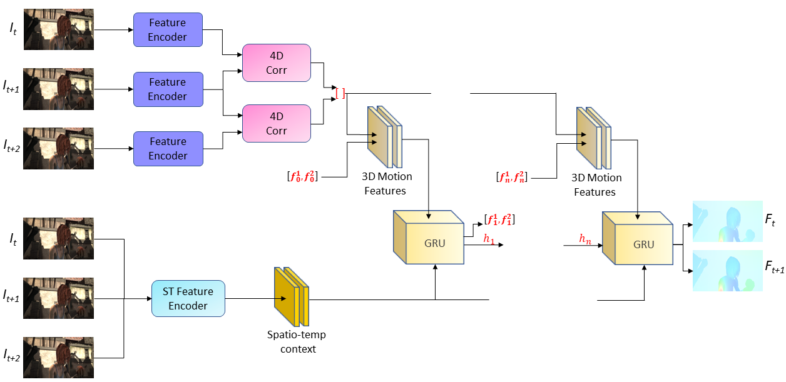
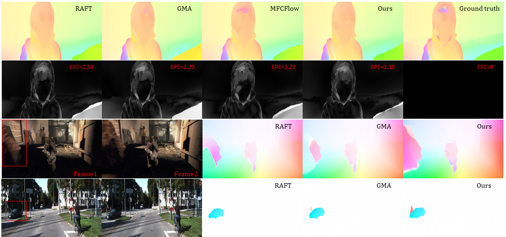
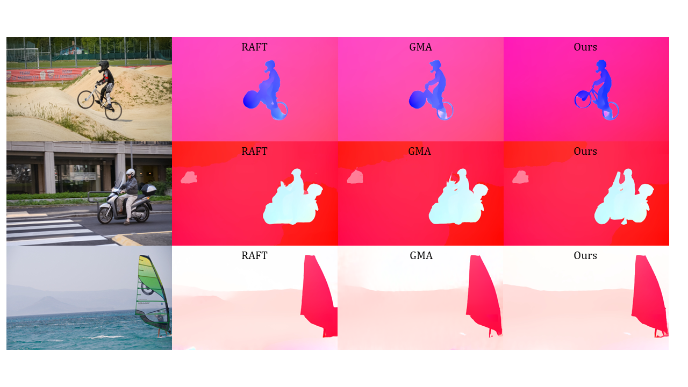

# SSTM
This repository contains the source code for our paper:

[SSTM: Spatiotemporal recurrent transformers for multi-frame optical flow estimation](https://www.sciencedirect.com/science/article/abs/pii/S0925231223008287?via%3Dihub)<br/>
Neurocomputing, 2023 <br/>
Fisseha A. Ferede, Madhusudhanan Balasubramanian<br/>

## I. Architecture




## II. Evaluation 

```bash
# Clone SSTM repository
git clone https://github.com/Computational-Ocularscience/SSTM.git
conda env create -f sstm.yml
conda activate sstm
python SSTM/evaluate.py --model=checkpoints/sstm_t++-sintel.pth --dataset=sintel
```

## III. Sample Results
The following results visually showcase the superiority of our method compared to other recent state-of-the-art methods. Signifying our methods ability to exploit temporal information across multiple frames to give a more generalized optical flow estimate.

1. Sample results on standard benchmark datasest for optical flow estimation (Sintel and KITTI2015)


2. Sample results on unseen datasets (datasets that were not part of training or validation)


## IV. Cite

If you find this work useful please cite:
```
@article{ferede2023sstm,
  title={SSTM: Spatiotemporal recurrent transformers for multi-frame optical flow estimation},
  author={Ferede, Fisseha Admasu and Balasubramanian, Madhusudhanan},
  journal={Neurocomputing},
  volume={558},
  pages={126705},
  year={2023},
  publisher={Elsevier}
}
```