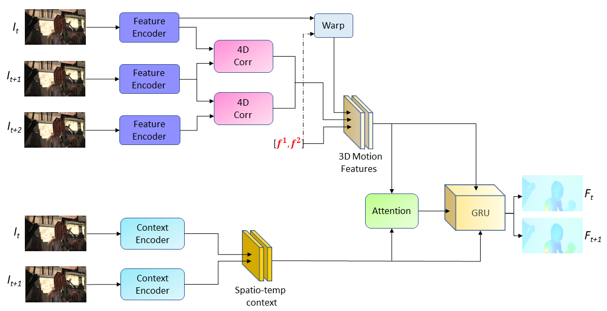

# SSTM
This repository contains the source code for our paper:

[SSTM: Spatiotemporal recurrent transformers for multi-frame optical flow estimation](https://www.sciencedirect.com/science/article/abs/pii/S0925231223008287?via%3Dihub) 
Neurocomputing, 2023  
Fisseha A. Ferede, Madhusudhanan Balasubramanian 

## I. Architecture

