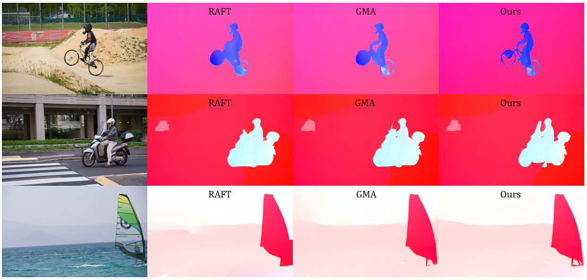

# SSTM
This repository contains the source code for our paper:

[SSTM: Spatiotemporal recurrent transformers for multi-frame optical flow estimation](https://www.sciencedirect.com/science/article/abs/pii/S0925231223008287?via%3Dihub)<br/>
Neurocomputing, 2023 <br/>
Fisseha A. Ferede, Madhusudhanan Balasubramanian<br/>

## I. Architecture


## II. Evaluation 

```bash
# Clone SSTM repository
git clone https://github.com/Computational-Ocularscience/SSTM.git
conda env create -f sstm.yml
conda activate sstm
python SSTM/evaluate.py --model=checkpoints/sstm_t++-sintel.pth --dataset=sintel
```

## III. Sample Results


Sample results on standard benchmark datasest for optical flow estimation (Sintel and KITTI2015)


Sample results on unseen datasets (datasets that were not part of training or validation)
